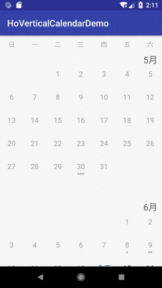

# HoVerticalCalendarView

Author : hosle

Created in 14th June 2018


## Feature
* 支持连续月份的上下自由滚动
* 支持每天日期下添加任务计数标示
* 每天日期支持设置点击事件，返回点击的Calendar类实例
* 滚动时，月份标签顶部冻结



## Usage

### 1.1. 添加日历视图到布局文件

activity_main.xml

```xml

<LinearLayout xmlns:android="http://schemas.android.com/apk/res/android"
    xmlns:app="http://schemas.android.com/apk/res-auto"
    xmlns:tools="http://schemas.android.com/tools"
    android:layout_width="match_parent"
    android:layout_height="match_parent"
    android:orientation="vertical"
    tools:context="com.hosle.vertical_calendar.demo.MainActivity">

    <com.hosle.calendar.verticalcalendar.view.VerticalCalendarView
        android:id="@+id/calendar_view"
        android:layout_width="match_parent"
        android:layout_height="wrap_content"/>

</LinearLayout>
```

### 1.2. 设置日历参数
在Activity 的```fun onCreate()```方法中，设置日历参数。

（1）配置日历的月份范围，需要传入一个指代年份和月份值的二维数组

（2）定义并传入日期点击事件的回调

（3）定义并传入获取每天任务事件数的方法参数


```kotlin
calendar_view.setCalendarParams(createMonth(4)/** set the month arange **/, 
		object : MonthView.OnDayClickListener {
            override fun onDayClick(view: MonthView, day: Calendar) {
                // callback on click to the specific day
            }

        }, 
        { calendar ->
            run {
                // interface to set the task count to each day
            }
        })
```


## Key Point

### 2.1. 绘制月份View
* **整体框架**

实现垂直的连续滚动，可以使用RecyclerView。每个ItemView为一个月份的View。

* **以月份为子View**

月份的View若使用如LinearLayout来布局，最小单元为天，那么一个月的ItemView至少将会包含28个子View。这样的方案需要重复多次View的“measure-layout-draw”的流程，效率较低。

参考```android.widget.SimpleMonthView```的设计思想，自定义view。

* **提供任务标识数据读取接口**

从日历的Map中获取任务数，绘制标识到对应的日期底部

### 2.2. 月份标签顶部冻结及动效

* **手势事件** 

（1） 假设冻结月份栏的layout位置左、上、右、下分别为：*lleft*, *ltop*, *lright*, *lbottom* ,初始位置则为 *lleft0*, *ltop0*, *lright0*, *lbottom0*, 月份栏的高度为h,  滚动回调onScrollListener返回的位移量分别为*dx*, *dy*。

（2） 利用LinearLayoutManager的findFirstVisibleItemPosition()方法，判断RecyclerView内，上／下一个月份ItemView的切换

* 向下滑动时，冻结栏从 (*lleft0*, *ltop0-h*, *lright0*, *lbottom0-h*) 开始向下移动
* 向上滑动时，冻结栏从(*lleft0*, *ltop0*, *lright0*, *lbottom*)开始向上移动

（3） 以第二个可见月份子View的顶部，作为分界线*line*。到达冻结月份栏高度h的时候，触发冻结栏位置的动效变化。设定最小值以保证月份栏动效不滑出边界。
	* line的位置top小于h时，冻结栏的位置为(*lleft0*, *min(ltop-dy,ltop0)*, *lright0*, *min(lbottom-dy, lbottom0)*)。
	* line的位置top大于等于h时，冻结栏的位置为默认位置(*lleft0*, *ltop0*, *lright0*, *lbottom0*)。


## License

Copyright (C) 2018. Henry Tam (hosle)

Contact: hosle@163.com

Licensed under the Apache License, Version 2.0 (the "License"); you may not use this file except in compliance with the License. You may obtain a copy of the License at

http://www.apache.org/licenses/LICENSE-2.0

Unless required by applicable law or agreed to in writing, software distributed under the License is distributed on an "AS IS" BASIS, WITHOUT WARRANTIES OR CONDITIONS OF ANY KIND, either express or implied. See the License for the specific language governing permissions and limitations under the License.


